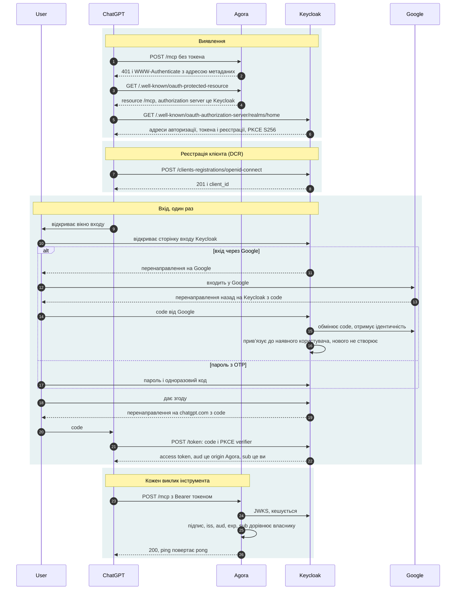
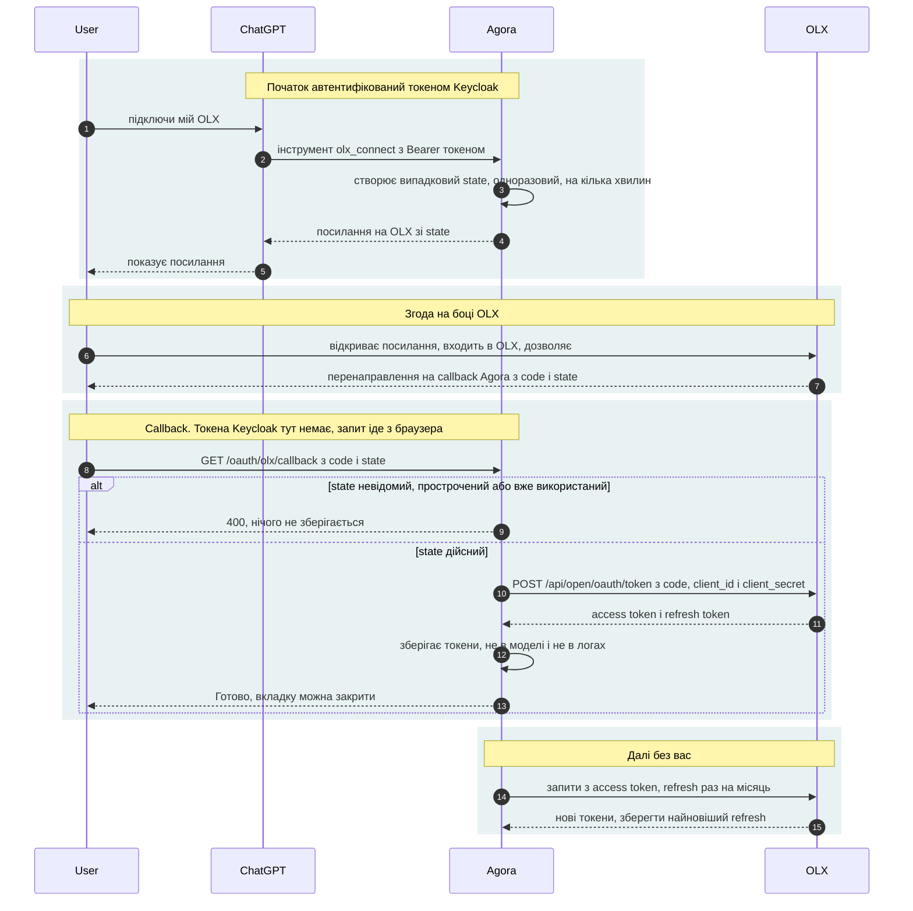
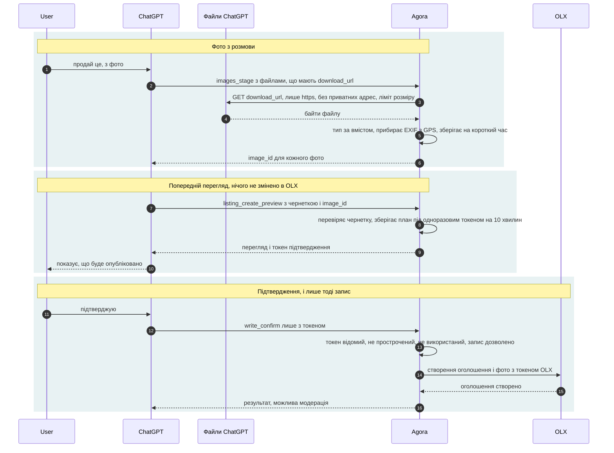

# Agora flows

Sequence diagrams of the three processes between the owner, ChatGPT, Agora, Keycloak, Google and OLX. Diagrams are Mermaid, rendered by GitHub. Design background: [DESIGN.md](DESIGN.md), section 7 (auth) and section 4 (tools).

Legend: **User** is the owner and their browser. **ChatGPT** means OpenAI's servers, not the browser. **Agora** is this MCP server. **Keycloak** handles the login into Agora. **Google** is one way to log in to Keycloak (linked to the existing owner user). **OLX** holds the listings.

## 1. ChatGPT connects to Agora

Status: **verified** in the Traefik and Agora logs on 2026-09-19. Happens once, when the connector is added. After that ChatGPT sends the token with every call.

Notes:

- Google only confirms who the owner is. The token for Agora is issued by Keycloak, not Google, so dropping Google later breaks nothing.
- The token belongs to ChatGPT and arrives as a header from OpenAI's servers, not from the owner's browser.
- Agora never issues tokens, it only verifies them. The owner check (`sub`) and the mandatory `exp` are added by Agora on top of FastMCP's JWT verifier.
- Keycloak's RFC 8414 metadata URL must be public, or ChatGPT reports that OAuth is not supported.
- Cost: Cloudflare Bot Fight Mode blocked the registration request, so it is disabled for the whole zone.

## 2. Agora connects to OLX

Status: **planned**, not implemented. A separate OAuth relationship: the token is issued by OLX and lets Agora act on the owner's behalf. Keycloak is not involved.

Notes:

- The callback is requested by the browser, so a Keycloak token cannot be required on it. It is protected by `state`: without a known, unexpired, unused value the request is rejected.
- The callback can be served on the LAN only, in which case it is not public at all.
- OLX's refresh token may change on refresh, so the newest one is always stored.
- Unverified: whether OLX approves an application from a private person, and whether it accepts a local or `http` callback.

## 3. Creating a listing with photos from the conversation

Status: **planned**, not implemented. Two steps on purpose (preview, then confirm): no tool changes OLX from a single call.

Notes:

- Photo bytes never pass through the model, only `image_id` values.
- The confirmation token is bound to the exact plan payload, so it cannot be altered between preview and write.
- Writes are disabled until `AGORA_WRITES` is enabled, and have a daily cap.
- Unverified: what ChatGPT sends for attached photos on web and on mobile; whether OLX accepts photos as files or by URL; how long moderation takes.
